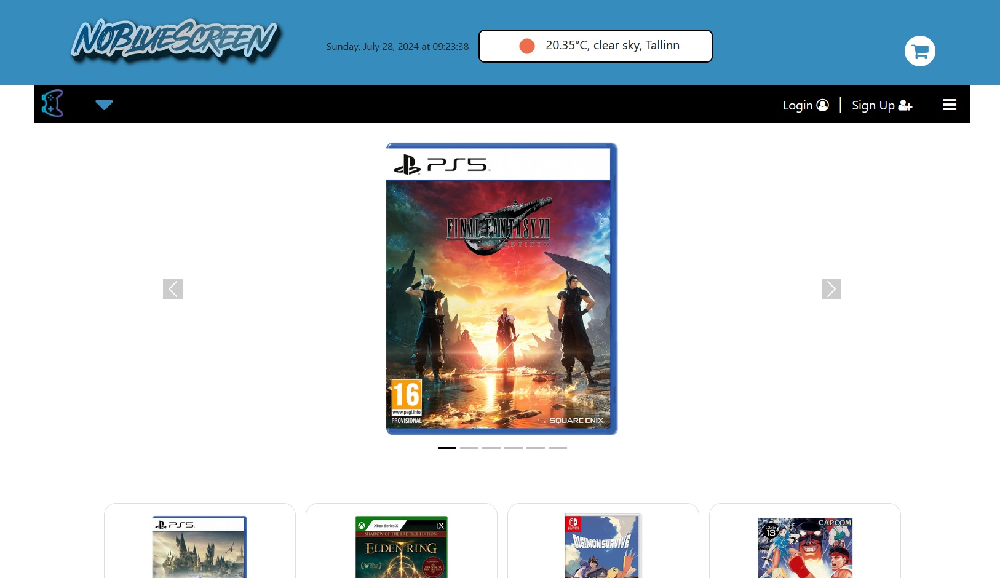

# NoBlueScreen

NoBlueScreen is a Django-based project, consisting on an e-commerce webpage focused in selling videogames of every
period and console. 

The website is featured by an essential but practical weather widget, and it allows the user to:
 <ul>
<li>add the products he would like to purchase to the cart;</li>
<li>select the desired amount of each of them;</li>
<li>fill in a form containing contacts and payment methods, in order to proceed with the order;</li>
<li>review the products he purchased, both leaving a feedback and rating them in a scale from 1 to 5;</li>
<li>update his feedbacks also in a second moment.</li>
</ul>

<h3>Content Management System (CMS)</h3>
The project has an active admin panel which is accessible via admin/. All CRUD operations can be performed there. 

<h3>Installation and usage</h3>
<h4>Local installation (macOS/Linux)</h4>
<ol>
<li>Clone the repository in the desired folder and create a virtual environment for it. At the moment of its creation, NoBlueScreen runs with Python 3.12; 
<code>python3 -m venv venv</code> 
<code>source venv/bin/activate</code></li>
<li>Install the requirements 
<code>pip install -r requirements.txt</code></li>
<li>Create a file named .env, where to store all the relevant information about the environment, namely: 
<ul>
<li>Secret key in a variable called <code>SECRET_KEY</code></li>
<li>Database name in a variable called <code>POSTGRES_DB</code></li>
<li>Database user in a variable called <code>POSTGRES_USER</code></li>
<li>User's password in a variable called <code>POSTGRES_PASSWORD</code></li>
<li>Host of the server in a variable called <code>POSTGRES_HOST</code></li>
</ul>
</li>
<li>
Install postgres database and properly set it on the machine.
</li>
<li>
Run migrations 
<code>python manage.py makemigrations</code> 
<code>python manage.py migrate</code>
</li>
<li>
Run the server and access the page at the path indicated in the terminal 
<code>python manage.py runserver</code> 
</li>
</ol>
<h4>Local installation (Windows)</h4>

<ol>
<li>Clone the repository in the desired folder and create a virtual environment for it. At the moment of its creation, NoBlueScreen runs with Python 3.12; 
<code>python -m venv venv</code> 
<code>.\venv\Script\activate</code></li>
</ol>
